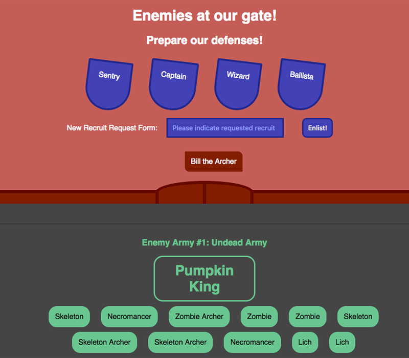

# Project Summary



ENEMIES AT OUR GATE! In this mini project we will use `axios` to make requests to an API of characters. We'll be creating, reading, updating, and deleting these characters from the API. The API exists as a file called `db.json` in the project folder and is served up through `json-server`, a dependency in the `package.json` file which simulates a hosted API. Since our edits will change the `db.json` file, I included a copy of the API database at the bottom so you can start over if necessary. If you are interested in how `json-server` was used in this project, there are some notes you can read at the bottom after completing today's mini project. For the purposes of this project, just know you'll be interacting with the API in a similar way to how you would in a real environment. We'll make use of `GET`, `POST`, `PATCH`, and `DELETE` methods in our requests.

## Setup

* Open a terminal window:
  * `Fork` and `clone` this repository.
  * `cd` into the `rpg` project directory.
  * Run `npm i` to install dependencies.
  * Run `npm start` to spin up the development server.
* In a second terminal window:
  * `cd` into the `rpg` project directory.
  * Run `npm run api`. This will run a script in the package.json file that will run json-server, point to our API file, and set a port. The API has been set up to have a short delay.
* You should now have two processes running in two separate terminal windows. Open a third window and run `npm install axios`. You can also use this third window if you want to commit any changes as you go, but keep the first two window running your app and your api.

## Step 1: getEnemies request

### Summary

* Start by glancing at the simple app. With the enemy armies approaching, we have four main defenses at the top of our screen: the Sentry, the Captain, the Wizard, and the Ballista. These four defenses represent the four axios requests we'll be using, respectively: `GET`, `POST`, `PATCH`, and `DELETE`. (`PATCH` is similar to `PUT` in that it updates our API, but `PATCH` allows us to change just a portion of the thing we are changing, and not the whole thing.)
* Note that only the Sentry will actually be turned into a clickable button. However, hovering over any of the four will display some simple instructions about how the axios requests are made.
* In this first step, we will start with our Sentry, adding a service that makes a call to the API and returns all characters. We will reformat that data with a pre-existing utility function so the data can then be rendered on the page the way we need it to.

### Instructions

* Enemies are approaching, but we cannot see them yet. We need the Sentry to do a GET request to view the enemies armies stored in the API.
* We'll be using some services to create our axios requests, so create a `services` folder inside your `src` folder. Inside, create a file called `getEnemies.js`.
* In this new file, import `axios` at the top.
* Create and export a function called `getEnemies` that takes in no parameters and returns an axios GET request (using `axios.get` and passing in the endpoint URL).
  * Our API will be served by `localhost` using port 3005.
  * We will use the URL `/all` to get all characters in the API.
    ``<details>
      <summary> <code> URL </code> </summary>

      ```js
      return axios.get('http://localhost:3005/all')
      ```
      </details>
  * Make use of the `then()` method to handle the promise. When this method is called, it will take in a callback function with a single argument: the response value returned when the promise is fulfilled. This response contains the information we requested from the API, including data about all characters. Return this response, remembering that we really only want the requested `data` stored in the response object, not the entire object.
    <details>
      <summary> <code> getEnemies service </code> </summary>

      ```js
      export function getEnemies() {
        return axios.get('http://localhost:3005/all')
        .then(res => {
          return (res.data)
        })
      }
      ```
      </details>
  * If you were to hit the endpoint in Postman now, you would see the information we requested. However, the API is returning the information in a different format than what we need, so we will pass the information through a utility function designed to reformat the data. We need a function that shows an understanding of both how the incoming API data is formatted and how our application needs it to be formatted.
    * Luckily, this function has already been created. It is called `turnApiObjIntoArray.js` and it exists in the `utils` folder. It is designed to take in the API response as an argument and reformat it into an array we can use to display the data in our React app.
    * All we need to do here is import the function into our `getEnemies` service and then adjust our service function to call the imported utility function on our response data, returning the correctly formatted data instead of the data in its original format.

  ### Solution for getEnemies service

  <details>

  <summary> <code> src/services/getEnemies.js </code> </summary>

  ```js
  import axios from 'axios';
  import {turnApiObjIntoArray} from '../utils/turnApiObjIntoArray';

  export function getEnemies() {
    return axios.get('http://localhost:3005/all')
    .then(res => {
      return turnApiObjIntoArray(res.data)
    })
  }

  ```

  </details>


## Step 2: rendering enemies

  ### Summary

  * In this second step, we will render the API data on our view.
  * Up till this point, your app should not be broken. Although the app has no functionality at the beginning, there should be nothing more than minor errors in the console. Now that we are beginning to edit `App.js`, however, things may begin to break when you save your changes before finishing this step.

  ### Instructions
  Part 1
  * Our service is set up, but we need our front end to call a function to trigger our service function, and we need to create a place for the information to be displayed in the view.
  * Create a constructor function. On state, create a property called `armiesArray` and set it equal to an empty array. When the API is called and an array of enemies is returned, we will use `armiesArray` to store and display that data, mapping through array to show each item.

  Part 2
  * In the App components's `render` method, use the `map()` method to map over the `armiesArray` on state.
    * Declare a variable called `armies` to store the results.
    * The `map()` method is for arrays. It takes in a callback function that allows multiple parameters. We'll be using just the first two parameters, which represent the current item being mapped over and the index of that item in the array.
    * Let's set these parameters now and call them `army` and `armyIndex`.
      <details>
        <summary> <code> set up map function </code> </summary>

        ```jsx
          const armies = this.state.armiesArray.map((army, armyIndex) => ())
        ```

      </details>

    * The callback function will return some JSX representing an unordered list. Inside the opening `ul` tag, give the list a `className` of `"army"` and a `key` of `{armyIndex}`.
      * Notice that `"army"` has quotes because it is a string, and `{armyIndex}` has curly braces because JSX needs to treat it as a variable and render its value.
      * The `key` is something we add to elements being mapped over items in an array. It helps React track each item in the array. Each key should be unique. Here, since each item in our data array has a unique index, we can use that index as a convenient way to dynamically create keys for React to track each item.
    * Between the `ul` tags, we'll render three things:
      * An `h3` tag just like this: `<h3>Enemy Army #{army.id}: {army.name}</h3>`. This will act as a title for each army, introducing them by `army.id` and `army.name`.
        * In case you are wondering where these values come from, remember that `army` is the variable representing each item being mapped over, and the `id` and `name` are properties on those item objects. You can see these properties if you examine the `db.json` file in the project folder, just like you can the values stored in other APIs by visiting those web sites and seeing how those APIs are set up.
      * A `div` with a `className` of `"leader"`. Between the `div` tags, render `{army.leader}` to display each army's leader.
      * A `ul` representing that army's minions. Remember, this `ul` is nested within the first `ul` we made which had a `className` of `"army"`. We do this because our API has a nested array of minion objects inside each army object.
        * This nested `ul` should have a `className` of `"minions"`.
        * Between the `ul` tags, render the following in curly braces:
          * Call the `map()` method on `army.minions`. Inside the `map()` method, pass in a callback function that takes in two parameters representing each minion being mapped over and that minion's index. Call these `minion` and `minionIndex`.
          Inside the callback, return a list item. Inside the `li` opening tag, give each minion a `key` whose value is the minions's index, and include also a `className` of `minion`.
          * Between the `li` tags, render `minion.type`.
            <details>
              <summary> <code> minion list item </code> </summary>

              ```jsx
                <li key={minionIndex} className="minion">{minion.type}</li>
              ```

            </details>

  * We now have a variable called `armies` that will store our enemy data in a nested list. In the return statement, render this list inside the `div` with the `enemies` class (HINT: Look near the bottom of the JSX).

  Part 3

  We began our app by using axios to tell it how to request and receive data from our API. Then we established an array on state to receive that data and told our app how to render the data on the page. What is left is to simply create a way to call our service function to retrieve the data.
  * Import the `getEnemies` function into `App.js`.
  * You'll see a method in the component called `seeEnemies()`. Inside the code block for this method, call `getEnemies`, passing in no arguments, and then call `then()`.
    * The callback in the `then()` method will accept a variable representing the API data. Let's call it `apiData`. Remember, `getEnemies` will return all characters from the API after reformatting them to fit our needs. That data is what is being passed into our callback here.
    * The callback then sets the data on state, setting it as the value for `armiesArray`.
      <details> <summary> <code> seeEnemies component method </code> </summary>

        ```jsx
          seeEnemies() {
            getEnemies().then(apiData => {
              this.setState({
                armiesArray: apiData
              })
            })
          }
        ```

      </details>

  * Our method is set. While we are at it, let's use the `bind()` method to bind our component's context (its `this`) to our `seeEnemies` method. This will allow us to call the method elsewhere without breaking context. In other words, our app won't lose track of what `this.state` means when we call the `seeEnemies` method elsewhere, because we will have bound the method to this component's context.
  * Now let's use our Sentry to call the method we just defined. Inside the opening tag of the `div` with the `id` of `"sentry"`, add an `onClick` event that will call our component's `seeEnemies` method.
    <details> <summary> <code> seeEnemies onClick function </code> </summary>

      ```jsx
        onClick={this.seeEnemies}
      ```

    </details>

  Well done, Sentry! If all went well, you should be seeing no errors and a bunch of menacing armies approaching the gate. Scroll down the page to see three enemy armies at the gates.


  ### Solution for rendering enemies
  * Now let's use our Sentry to call the method we just defined. Inside the opening tag of the `div` with the `id` of `"sentry"`, add an `onClick` event that will call our component's `seeEnemies` method.
    <details> <summary> <code> src/App.js </code> </summary>

    ```jsx

    import React, { Component } from 'react';
    import './styles/App.css';

    import {getEnemies} from './services/getEnemies';

    class App extends Component {

      constructor() {
        super()

        this.state = {
          armiesArray: []
        }

        this.seeEnemies = this.seeEnemies.bind(this)
      }

      seeEnemies() {
        getEnemies().then(apiData => {
          this.setState({
            armiesArray: apiData
          })
        })
      }

      callTroops() {
      }

      recruitTroop() {
      }

      transformMinion() {
      }

      slayLeader() {
      }


      render() {
        const armies = this.state.armiesArray.map((army, armyIndex) => (
          <ul key={armyIndex} className="army">
            <h3>Enemy Army #{army.id}: {army.name}</h3>
            <div className="leader">{army.leader}</div>
            <ul className="minions">
              {army.minions.map((minion, minionIndex) => (
                <li key={minionIndex} className="minion">{minion.type}</li>
              ))}
            </ul>
          </ul>
        ))

        const message = this.state.armiesArray.length < 1 ? "ALL CLEAR" : "";

        return (
          <div className="App">

            {/* Main Defenses */}
            <div className="App-header">
              <h1>Enemies at our gate!</h1>
              <h2>Prepare our defenses!</h2>
              <div className="defenses">
                <div className="defense" id="sentry" onClick={this.seeEnemies}>Sentry<span className="instructions">Click here to see approaching enemies!</span></div>
                <div className="defense" id="captain">Captain<span className="instructions">Fill out paperwork below to recruit new troop!</span></div>
                <div className="defense" id="wizard">Wizard<span className="instructions">Click directly on a minion to cast a spell!</span></div>
                <div className="defense" id="ballista">Ballista<span className="instructions">Blast enemy leader to disperse army!</span></div>
              </div>
            </div>


            {/* Reinforcements */}
            <div className="reinforcements">
              <form type="submit">
                New Recruit Request Form:
                <input id="paperwork" placeholder="Please indicate requested recruit"/>
                <button >Enlist!</button>
              </form>
              <div id="wall">
                <span></span><span id="gate"></span><span></span>
              </div>
            </div>

            <h1 id="message">{message}</h1>

            {/* Enemy Armies */}
            <div className="enemies">
                {armies}
            </div>
          </div>
        );
      }
    }

    export default App;
    ```

    </details>


## Step 3: getTroops request

### Summary

* Did that last step feel huge? Well now it gets better. In the last step, we went into detail about how to map through API data to render it in the React view. This step is like a mini-version of the last one.
* It is our Captain's job to manage existing troops and post new troops to defend the line. Those defensive troops are also stored in the API database, just like the enemies. Let's get 'em.

### Instructions

* In the `services` folder, create a file called `getTroops.js`.
* Import `axios`.
* Create and export a function called `getTroops`. It will be very similar to the `getEnemies` function.
  * Use `axios.get`.
  * The URL route is `/defenses`.
    <details>
      <summary> <code> URL </code> </summary>

      ```js
      return axios.get('http://localhost:3005/defenses')
      ```
      </details>
  * The `then()` method will return the response data just like in our last service.
    <details>
      <summary> <code> getTroops service </code> </summary>

      ```js
      export function getTroops() {
        return axios.get('http://localhost:3005/defenses')
        .then(res => {
          return res.data
        })
      }
      ```
      </details>
  * One thing that is different here than from our last service is that we do not need to reformat the information coming in because the format for this information already fits our needs. Therefore, we will not be calling our utility function on the response data.

  ### Solution for getTroops service

  <details>

  <summary> <code> src/services/getTroops.js </code> </summary>

  ```js
  import axios from 'axios';

  export function getTroops() {
    return axios.get('http://localhost:3005/defenses')
    .then(res => {
      return res.data
    })
  }

  ```

  </details>


## Step 4: rendering troops

  ### Summary

  * Now let's render those troops.


  ### Instructions
  Part 1
  * Our service is set up. Now let's bring in the data.
  * In `App.js`, add `defensesArray` to state and set it equal to an empty array. This will store our defenses and let us map through them to display them.

  Part 2
  * In the `render` method, use `map()` to map over the `defensesArray`.
    * Declare a variable called `troops` to store the results.
    * Set the `map()` callback parameters to `troop` and `troopIndex`.
      <details>
        <summary> <code> set up map function </code> </summary>

        ```jsx
          const troops = this.state.defensesArray.map((troop, troopIndex) => ())
        ```

      </details>

    * The callback function will return a repeated `li`.
      * Give the `li` a className of `troop`.
      * Give the `li` a `key` of `{troopIndex}`.
      * Between the `li` tags, render `troop.recruit`.

  * We now have a variable called `troops` that will store our troop data. In the return statement, render this variable between the `ul` tags in the `troops` list.

  Part 3

  Let's create a method to get our troops. They know it's their duty to always be ready, so we'll create a method that is automatically called when the page loads, rather than waiting for someone to push a button to summon them.
  * Import the `getTroops` function into `App.js`.
  * In the `callTroops()` method, call `getTroops`. Pass in no arguments.
    * The callback in the `then()` method will accept a variable representing the API data. Let's call it `apiData`.
    * The callback sets the returned data on state, setting it as the value for `defensesArray`.
      <details> <summary> <code> callTroops component method </code> </summary>

        ```jsx
          callTroops() {
            getTroops().then(apiData => {
              this.setState({
                defensesArray: apiData
              })
            })
          }
        ```

      </details>

  * Did you bind the context to our new method already? Because we don't actually need to this time.
  * We want the troops to show up as soon as the view loads. For that, we will use one of React's lifecycle methods: `componentDidMount`. This method will appear next to the other methods in our component. However, since we won't be calling `componentDidMount` manually somewhere else in the code, we don't need to bind the context. Rather, `componentDidMount` is called automatically when the component finishes mounting.
  * Inside the lifecycle method, simply call `this.callTroops`.
    <details> <summary> <code> componentDidMount </code> </summary>

      ```jsx
        componentDidMount() {
          this.callTroops();
        }
      ```

    </details>

  Good job! By now you should be seeing trusty Bill, the archer. He takes his duties very seriously. But he's probably not enough to hold back several armies of enemies. It looks like the Captain will have to fill out a request for some new troops.


  ### Solution for rendering troops
  <details> <summary> <code> src/App.js </code> </summary>

  ```jsx

  import React, { Component } from 'react';
  import './styles/App.css';

  import {getEnemies} from './services/getEnemies';
  import {getTroops} from './services/getTroops';

  class App extends Component {

    constructor() {
      super()

      this.state = {
        armiesArray: []
        ,defensesArray: []
      }

      this.seeEnemies = this.seeEnemies.bind(this)
    }

    seeEnemies() {
      getEnemies().then(apiData => {
        this.setState({
          armiesArray: apiData
        })
      })
    }

    callTroops() {
      getTroops().then(apiData => {
        this.setState({
          defensesArray: apiData
        })
      })
    }

    recruitTroop() {
    }

    transformMinion() {
    }

    slayLeader() {
    }

    componentDidMount() {
      this.callTroops();
    }

    render() {
      const armies = this.state.armiesArray.map((army, armyIndex) => (
        <ul key={armyIndex} className="army">
          <h3>Enemy Army #{army.id}: {army.name}</h3>
          <div className="leader">{army.leader}</div>
          <ul className="minions">
            {army.minions.map((minion, minionIndex) => (
              <li key={minionIndex} className="minion">{minion.type}</li>
            ))}
          </ul>
        </ul>
      ))

      const troops = this.state.defensesArray.map((troop, troopIndex) => (
        <li className="troop">{troop.recruit}</li>
      ))

      const message = this.state.armiesArray.length < 1 ? "ALL CLEAR" : "";

      return (
        <div className="App">

          {/* Main Defenses */}
          <div className="App-header">
            <h1>Enemies at our gate!</h1>
            <h2>Prepare our defenses!</h2>
            <div className="defenses">
              <div className="defense" id="sentry" onClick={this.seeEnemies}>Sentry<span className="instructions">Click here to see approaching enemies!</span></div>
              <div className="defense" id="captain">Captain<span className="instructions">Fill out Request Form below to recruit new troop!</span></div>
              <div className="defense" id="wizard">Wizard<span className="instructions">Click directly on a minion to cast a spell!</span></div>
              <div className="defense" id="ballista">Ballista<span className="instructions">Blast enemy leader to disperse army!</span></div>
            </div>
          </div>


          {/* Reinforcements */}
          <div className="reinforcements">
            <form type="submit">
              New Recruit Request Form:
              <input id="paperwork" placeholder="Please indicate requested recruit"/>
              <button >Enlist!</button>
            </form>

            <ul className="troops">
              {troops}
            </ul>

            <div id="wall">
              <span></span><span id="gate"></span><span></span>
            </div>
          </div>

          <h1 id="message">{message}</h1>

          {/* Enemy Armies */}
          <div className="enemies">
              {armies}
          </div>
        </div>
      );
    }
  }

  export default App;
  ```

  </details>


## Step 5: postTroop service

### Summary

* Let's use `POST` requests to call in new Troops.

### Instructions

* Set up a new service called `postTroop.js`. This one will have a single parameter representing the troop we requested (we make the request using an `input` box on the page). Let's call that parameter variable `recruit`.
  * The method for this service function is `POST`.
  * The URL route is `/defenses`.
  * In addition to passing in a URL to `axios`, we must also pass in a request object. Our API database shows that each troop is an object with a single property: `recruit`. Therefore, if we want a new recruit with a format that matches our API, we should pass in a request object with a property called `recruit`. We'll set it equal to the value represented by the `recruit` variable we passed into the `postTroop` service function.
    <details>
      <summary> <code> URL </code> </summary>

      ```js
      return axios.post('http://localhost:3005/defenses/', {recruit: recruit})
      ```
      </details>
  * The `then()` method will simply return the response status. Unlike in our `GET` services, we are sending data rather than receiving it back.

  ### Solution for postTroop service

  <details>

  <summary> <code> src/services/postTroop.js </code> </summary>

  ```js
  import axios from 'axios';

  export function postTroop(recruit) {
    return axios.post('http://localhost:3005/defenses/', {recruit: recruit})
    .then(res => {
      return res.status;
    })
  }


  ```

  </details>


## Step 6: using input to call postTroop service

  ### Summary

  * We have a handy form already, but it doesn't do much. Let's use it to request new troops. We'd like to be able to type in any kind of recruit and see that recruit appear next to Bill the Archer.


  ### Instructions
  Part 1
  * Our service is set up. Now let's handle the data within `src/App.js`.
  * In `App.js`, add `newRecruit` to state and set it equal to an empty string. This will store the information from our form input to be passed on to the service function.

  Part 2

  Let's create two methods to help post a new recruit. Our first method is called `recruitTroop` and will connect to our `postTroop` function.
  * Before writing this method, import the `postTroop` function into `App.js`.
  * Now the `recruitTroop` method already exists, but it needs to be fleshed out. Start by passing in two parameters: `event` and `recruit`. They represent, respectively, the event occurring when a form is submitted and the string value which is entered into the form input. More on those in just a minute.
  * In the `recruitTroop()` method, call `postTroop`. Pass in the same `recruit` variable just mentioned.
    * The callback called a previous method we made, `callTroops`. That way, as soon as we post a new recruit, we make a request to the API to return all troops, ensuring they all appear in the view.
    * If someone decides to hit the Enlist button without filling out the form, we don't want a bunch of empty objects appearing where soldiers should be. So let's test for empty strings by wrapping the call to our `postTroop` service function in an `if` statement.
      * We can simply test the truthiness of `recruit`, since `recruit` is a string and non-empty strings are truthy and empty strings are falsy. If `recruit` is a non-empty string, `postTroop` will be called to post the new recruit.
      * If the `if` statement passes and a new recruit is submitted, it might be nice to automatically clear out the form to allow something new to be typed.
        * Inside the `if` statement, after `callTroops()` is called, let's set the input's `value` to an empty string.
        * The React way to do this is to set the state of the property, which will cause a re-render. Use `setState` to do this now.
        * Since we are here and talking about the React way, let's also add something to our `input` tag to help React track the `input` value. Add `value={this.state.newRecruit}` to the `input` tag. The `value` is a property of inputs, so setting it equal to `this.state.newRecruit` tells React that the value in the `input` should be equal to the value on state.
        value={this.state.newRecruit}
          <details> <summary> <code> clear out input </code> </summary>

            ```jsx
            this.setState({
              newRecruit: ''
            })
            ```

          </details>

  Our second method is a simple method for handling what is typed into the input.
  * Call the method `handleInput`. Pass in `event`. Here, `event` represents the event of something being typed into the input. It occurs every time a new character is typed.
  * Inside the method, set the state, changing the value of `newRecruit` (which starts as an empty string if you recall) to the value currently typed into the input. Use `target.value`.
    <details> <summary> <code> handleInput </code> </summary>

      ```jsx
        handleInput(event) {
          this.setState({
            newRecruit: event.target.value
          })
        }
      ```

    </details>

  Part 3

  Let's activate edit the input and Enlist button to send our requests.
  * Inside the input box, add an `onChange` event listener to watch for anything being typed into the box. The value of `onChange` will be an arrow function that passes in the event and then calls our `handleInput` method on that event. This sets our `this.state.newRecruit` value equal to what is being typed.
    <details> <summary> <code> onChange input event </code> </summary>

      ```jsx
        onChange={(e) => this.handleInput(e)}
      ```

    </details>
  * Inside the button, add an `onClick` event listener to watch for the button to be clicked. Here, the event is not what is typed into the input; it is the act of submitting the form. The value of `onClick` will be an arrow function that passes in the event and then calls our `recruitTroop` method, passing in the event and the current value of `this.state.newRecruit`.
    <details> <summary> <code> onClick input event </code> </summary>

      ```jsx
        onClick={(e) => this.recruitTroop(e, this.state.newRecruit)}
      ```

    </details>

    * I told you we would come back to the importance of `event` and `recruit` when we were setting up our `recruitTroop` method. We need to pass in the recruit value so it can be passed to our service function to become the value of the request object, which is then sent to the API database.
    * We need to pass in the event because we need our `recruitTroop` method to prevent a default action performed by submit buttons which causes the page to refresh. If you have everything working a this point, you may have noticed that requesting a new troop causes the enemy armies to disappear. That is because clicking the submit button refreshes the view. To prevent that, simply call the `preventDefault()` method on the `event` passed into the `recruitTroop` method. Do this at the top of the method's code block.

    <details> <summary> <code> updated recruitTroop method </code> </summary>

      ```jsx
      recruitTroop(event, recruit) {
        event.preventDefault()
        if (recruit) {
          postTroop(recruit).then(() => {
            this.callTroops();
            this.setState({
              newRecruit: ''
            })
          })
        }
      }
      ```

    </details>

  Well done, Captain! Now add some troops! Whatever you need! I recommend some knights or some more archers to help out trusty Bill.


  ### Solution for posting troops
  <details> <summary> <code> src/App.js </code> </summary>

  ```jsx

  import React, { Component } from 'react';
  import './styles/App.css';

  import {getEnemies} from './services/getEnemies';
  import {getTroops} from './services/getTroops';
  import {postTroop} from './services/postTroop';

  class App extends Component {

    constructor() {
      super()

      this.state = {
        armiesArray: []
        ,defensesArray: []
      }

      this.seeEnemies = this.seeEnemies.bind(this)
      this.recruitTroop = this.recruitTroop.bind(this)
    }

    seeEnemies() {
      getEnemies().then(apiData => {
        this.setState({
          armiesArray: apiData
        })
      })
    }

    callTroops() {
      getTroops().then(apiData => {
        this.setState({
          defensesArray: apiData
        })
      })
    }

    recruitTroop(event, recruit) {
      event.preventDefault()
      if (recruit) {
        postTroop(recruit).then(() => {
          this.callTroops();
          this.setState({
            newRecruit: ''
          })
        })
      }
    }

    handleInput(event) {
      this.setState({
        newRecruit: event.target.value
      })
    }

    transformMinion() {
    }

    slayLeader() {
    }

    componentDidMount() {
      this.callTroops();
    }

    render() {
      const armies = this.state.armiesArray.map((army, armyIndex) => (
        <ul key={armyIndex} className="army">
          <h3>Enemy Army #{army.id}: {army.name}</h3>
          <div className="leader">{army.leader}</div>
          <ul className="minions">
            {army.minions.map((minion, minionIndex) => (
              <li key={minionIndex} className="minion">{minion.type}</li>
            ))}
          </ul>
        </ul>
      ))

      const troops = this.state.defensesArray.map((troop, troopIndex) => (
        <li className="troop">{troop.recruit}</li>
      ))

      const message = this.state.armiesArray.length < 1 ? "ALL CLEAR" : "";

      return (
        <div className="App">

          {/* Main Defenses */}
          <div className="App-header">
            <h1>Enemies at our gate!</h1>
            <h2>Prepare our defenses!</h2>
            <div className="defenses">
              <div className="defense" id="sentry" onClick={this.seeEnemies}>Sentry<span className="instructions">Click here to see approaching enemies!</span></div>
              <div className="defense" id="captain">Captain<span className="instructions">Fill out Request Form below to recruit new troop!</span></div>
              <div className="defense" id="wizard">Wizard<span className="instructions">Click directly on a minion to cast a spell!</span></div>
              <div className="defense" id="ballista">Ballista<span className="instructions">Blast enemy leader to disperse army!</span></div>
            </div>
          </div>


          {/* Reinforcements */}
          <div className="reinforcements">
            <form type="submit">
              New Recruit Request Form:
              <input onChange={(e) => this.handleInput(e)} id="paperwork" placeholder="Please indicate requested recruit" value={this.state.newRecruit}/>
              <button onClick={(e) => this.recruitTroop(e, this.state.newRecruit)}>Enlist!</button>
            </form>

            <ul className="troops">
              {troops}
            </ul>

            <div id="wall">
              <span></span><span id="gate"></span><span></span>
            </div>
          </div>

          <h1 id="message">{message}</h1>

          {/* Enemy Armies */}
          <div className="enemies">
              {armies}
          </div>
        </div>
      );
    }
  }

  export default App;

  ```

  </details>

## Step 7: patchMinion request

### Summary

Let's call on the Wizard to help out our troops! The Wizard will make use of the `PATCH` request to transform those minions into something less threatening.

### Instructions

* In the `services` folder, create a file called `patchMinions.js`. Create and export a service function.
  * Each army has a shortname in the API database (e.g., "undead", "barbarian", "goblin"), and each minion of each army has an ID. Pass a `shortname` parameter and an `id` parameter into our service function.
  * Use `axios.patch`.
  * If you wanted to transform the second minion of the barbarian army, the URL would be `/barbarian/minions/2`. However, we need to create a dynamic URL here that will be based on the `shortname` and `id` arguments that are passed in. Using your JavaScript knowhow, put together a URL using both strings and variables so that it will be dynamic.
    <details>
      <summary> <code> URL </code> </summary>

      ```jsx
      return axios.patch('http://localhost:3005/' + shortname + '/minions/' + id)
      ```
      </details>
  * Following the URL, pass in a request object with a `type` property to match the property of minions in the API database. Set the value to `"frog"`.
  * The `then()` method will return the response status.

  ### Solution for patchMinions service

  <details>

  <summary> <code> src/services/patchMinions.js </code> </summary>

  ```jsx
  import axios from 'axios';

  export function patchMinion(shortname, id) {
    return axios.patch('http://localhost:3005/' + shortname + '/minions/' + id, {type: "frog"})
    .then(res => {
      return res.status
    })
  }

  ```

  </details>


## Step 8: transforming minions

  ### Summary

  Set the Wizard loose on those minions!


  ### Instructions

  Let's create a method to transform those minions. We'll activate the request by clicking on each minion we want to change.
  * Import the `patchMinions` function.
  * In the `transformMinion()` method, pass in `armyShortname` and `minionId` as parameters. Call `patchMinions` and pass in the same parameters.
    * The callback merely calls our component's `seeEnemies` method, which allows the data to be updated after the change is made to the database.
      <details> <summary> <code> transformMinion component method </code> </summary>

        ```jsx
          transformMinion(armyShortname, minionId) {
            patchMinion(armyShortname, minionId).then(() => {
              this.seeEnemies();
            })
          }
        ```

      </details>

  * Inside the opening tag for the `li` element with the `className` of `minion`, add an `onClick` event that has an arrow function that calls our `transformMinion` method and passes in the shortname for the army and the ID for the minion (which are properties on the enemy and minion objects).
    <details> <summary> <code> minion onClick event </code> </summary>

      ```jsx
        onClick={() => this.transformMinion(army.shortname, minion.id)}
      ```

    </details>

  Now you can transform any minion you touch. Well done, Wizard!


  ### Solution for transforming minions
  <details> <summary> <code> src/App.js </code> </summary>

  ```jsx
  import React, { Component } from 'react';
  import './styles/App.css';

  import {getEnemies} from './services/getEnemies';
  import {getTroops} from './services/getTroops';
  import {postTroop} from './services/postTroop';
  import {patchMinion} from './services/patchMinion';

  class App extends Component {

    constructor() {
      super()

      this.state = {
        armiesArray: []
        ,defensesArray: []
        ,newRecruit: ""
      }

      this.seeEnemies = this.seeEnemies.bind(this)
      this.recruitTroop = this.recruitTroop.bind(this)
    }

    seeEnemies() {
      getEnemies().then(apiData => {
        this.setState({
          armiesArray: apiData
        })
      })
    }

    callTroops() {
      getTroops().then(apiData => {
        this.setState({
          defensesArray: apiData
        })
      })
    }

    recruitTroop(event, recruit) {
      event.preventDefault()
      if (recruit) {
        postTroop(recruit).then(() => {
          this.callTroops();
          this.setState({
            newRecruit: ''
          })
        })
      }
    }


    handleInput(event) {
      this.setState({
        newRecruit: event.target.value
      })
    }

    transformMinion(armyShortname, minionId) {
      patchMinion(armyShortname, minionId).then(() => {
        this.seeEnemies();
      })
    }

    slayLeader() {
    }

    componentDidMount() {
      this.callTroops();
    }

    render() {
      const armies = this.state.armiesArray.map((army, armyIndex) => (
        <ul key={armyIndex} className="army">
          <h3>Enemy Army #{army.id}: {army.name}</h3>
          <div className="leader">{army.leader}</div>
          <ul className="minions">
            {army.minions.map((minion, minionIndex) => (
              <li key={minionIndex} className="minion" onClick={() => this.transformMinion(army.shortname, minion.id)}>{minion.type}</li>
            ))}
          </ul>
        </ul>
      ))

      const troops = this.state.defensesArray.map((troop, troopIndex) => (
        <li className="troop">{troop.recruit}</li>
      ))

      const message = this.state.armiesArray.length < 1 ? "ALL CLEAR" : "";

      return (
        <div className="App">

          {/* Main Defenses */}
          <div className="App-header">
            <h1>Enemies at our gate!</h1>
            <h2>Prepare our defenses!</h2>
            <div className="defenses">
              <div className="defense" id="sentry" onClick={this.seeEnemies}>Sentry<span className="instructions">Click here to see approaching enemies!</span></div>
              <div className="defense" id="captain">Captain<span className="instructions">Fill out Request Form below to recruit new troop!</span></div>
              <div className="defense" id="wizard">Wizard<span className="instructions">Click directly on a minion to cast a spell!</span></div>
              <div className="defense" id="ballista">Ballista<span className="instructions">Blast enemy leader to disperse army!</span></div>
            </div>
          </div>


          {/* Reinforcements */}
          <div className="reinforcements">
            <form type="submit">
              New Recruit Request Form:
              <input onChange={(e) => this.handleInput(e)} id="paperwork" placeholder="Please indicate requested recruit" value={this.state.newRecruit}/>
              <button onClick={(e) => this.recruitTroop(e, this.state.newRecruit)}>Enlist!</button>
            </form>

            <ul className="troops">
              {troops}
            </ul>

            <div id="wall">
              <span></span><span id="gate"></span><span></span>
            </div>
          </div>

          <h1 id="message">{message}</h1>

          {/* Enemy Armies */}
          <div className="enemies">
              {armies}
          </div>
        </div>
      );
    }
  }

  export default App;


  ```

  </details>


## Step 9: deleteArmy request

### Summary

Our Sentry, Captain, and Wizard have done a great job of keeping the enemies at bay, but those enemy leaders will need something serious. Let's get our ballista working so we can do some real damage.

### Instructions

* Create a service called `deleteArmy.js`.
  * As mentioned, each army has a shortname. Each army also has an ID. Pass a `shortname` parameter and an `id` parameter into the function in our service function.
  * Use `axios.delete`.
  * If you wanted to destroy the leader of the Great Goblin Family, the URL would be `/goblin/3`. However, as with the previous service, we will need a dynamic URL that can take in our variables.
    <details>
      <summary> <code> URL </code> </summary>

      ```jsx
      return axios.delete('http://localhost:3005/' + shortname + '/' + id)
      ```
      </details>
  * No request object is passed in. `axios.delete` uses the ID to delete everything. What this means here is that passing in the leader's ID will destroy that leader's entire army!

  ### Solution for deleteArmy service

  <details>

  <summary> <code> src/services/deleteArmy.js </code> </summary>

  ```jsx
  import axios from 'axios';

  export function deleteArmy(shortname, id) {
    return axios.delete('http://localhost:3005/' + shortname + '/' + id)
    .then(res => {
      return res.data
    })
  }

  ```

  </details>


## Step 10: destroying the enemy leaders

  ### Summary

  Fire the Ballista!


  ### Instructions

  Let's create a method to delete the leader of each army. We'll activate the request by clicking on each leader we want to delete.
  * Import the `deleteArmy` service function into `App.js`.
  * In the `slayLeader()` method, pass in `shortname` and `id` as parameters. Call `deleteArmy` and pass in the same parameters.
    * The callback merely calls our component's `seeEnemies` method.
      <details> <summary> <code> slayLeader component method </code> </summary>

        ```jsx
        slayLeader(shortname, id) {
          deleteArmy(shortname, id).then(() => {
            this.seeEnemies();
          })
        }
        ```

      </details>

  * Inside the opening tag for the `div` element with the `className` of `leader`, add an `onClick` event that has an arrow function that calls our `slayLeader` method and passes in the shortname and the ID for the army.
    <details> <summary> <code> leader onClick event </code> </summary>

      ```jsx
        onClick={() => this.slayLeader(army.shortname, army.id)}
      ```

    </details>

  Now you can take out the army leaders and clear the area of all enemies! Well done!


  ### Solution for slaying leaders
  <details> <summary> <code> src/App.js </code> </summary>

  ```jsx
  import React, { Component } from 'react';
  import './styles/App.css';

  import {getEnemies} from './services/getEnemies';
  import {getTroops} from './services/getTroops';
  import {postTroop} from './services/postTroop';
  import {patchMinion} from './services/patchMinion';

  class App extends Component {

    constructor() {
      super()

      this.state = {
        armiesArray: []
        ,defensesArray: []
        ,newRecruit: ""
      }

      this.seeEnemies = this.seeEnemies.bind(this)
      this.recruitTroop = this.recruitTroop.bind(this)
    }

    seeEnemies() {
      getEnemies().then(apiData => {
        this.setState({
          armiesArray: apiData
        })
      })
    }

    callTroops() {
      getTroops().then(apiData => {
        this.setState({
          defensesArray: apiData
        })
      })
    }

    recruitTroop(event, recruit) {
      event.preventDefault()
      if (recruit) {
        postTroop(recruit).then(() => {
          this.callTroops();
          this.setState({
            newRecruit: ''
          })
        })
      }
    }


    handleInput(event) {
      this.setState({
        newRecruit: event.target.value
      })
    }

    transformMinion(armyShortname, minionId) {
      patchMinion(armyShortname, minionId).then(() => {
        this.seeEnemies();
      })
    }

    slayLeader() {
    }

    componentDidMount() {
      this.callTroops();
    }

    render() {
      const armies = this.state.armiesArray.map((army, armyIndex) => (
        <ul key={armyIndex} className="army">
          <h3>Enemy Army #{army.id}: {army.name}</h3>
          <div className="leader">{army.leader}</div>
          <ul className="minions">
            {army.minions.map((minion, minionIndex) => (
              <li key={minionIndex} className="minion" onClick={() => this.transformMinion(army.shortname, minion.id)}>{minion.type}</li>
            ))}
          </ul>
        </ul>
      ))

      const troops = this.state.defensesArray.map((troop, troopIndex) => (
        <li className="troop">{troop.recruit}</li>
      ))

      const message = this.state.armiesArray.length < 1 ? "ALL CLEAR" : "";

      return (
        <div className="App">

          {/* Main Defenses */}
          <div className="App-header">
            <h1>Enemies at our gate!</h1>
            <h2>Prepare our defenses!</h2>
            <div className="defenses">
              <div className="defense" id="sentry" onClick={this.seeEnemies}>Sentry<span className="instructions">Click here to see approaching enemies!</span></div>
              <div className="defense" id="captain">Captain<span className="instructions">Fill out Request Form below to recruit new troop!</span></div>
              <div className="defense" id="wizard">Wizard<span className="instructions">Click directly on a minion to cast a spell!</span></div>
              <div className="defense" id="ballista">Ballista<span className="instructions">Blast enemy leader to disperse army!</span></div>
            </div>
          </div>


          {/* Reinforcements */}
          <div className="reinforcements">
            <form type="submit">
              New Recruit Request Form:
              <input onChange={(e) => this.handleInput(e)} id="paperwork" placeholder="Please indicate requested recruit" value={this.state.newRecruit}/>
              <button onClick={(e) => this.recruitTroop(e, this.state.newRecruit)}>Enlist!</button>
            </form>

            <ul className="troops">
              {troops}
            </ul>

            <div id="wall">
              <span></span><span id="gate"></span><span></span>
            </div>
          </div>

          <h1 id="message">{message}</h1>

          {/* Enemy Armies */}
          <div className="enemies">
              {armies}
          </div>
        </div>
      );
    }
  }

  export default App;


  ```

  </details>


## Notes on json-server

### Summary

Congratulations on finishing another mini project! For those who are interested in how `json-server` was used to simulate an API in this project, keep reading.

### Instructions

* Install json-server using `npm install json-server`. In this project, ```json json-server``` was in the dependencies, so it was installed automatically when you ran `npm install`.
* Create an API file with a .json extension. The API file used in this project is below these instruction.
* In this project, you had to run `npm run api` in a separate terminal window. In you package.json file, add a line like the one below into the scripts section:
```json
  "api": "json-server --watch db.json --port 3005 --routes routes.json --delay 500"
  ```
* When the `npm run api` script is run, this script:
  * points json-server to the db.json file,
  * assigned to port 3005,
  * connected to the routes.json file (where our custom routes are), and
  * told to delay the response by half a second.
* These last two options are unnecessary but add to the simulation of an actual API.

### Character API

<details>

<summary> <code> rpg/db.json </code> </summary>

```json
{
  "defenses": [
    {
      "id": 0,
      "recruit": "Bill the Archer"
    }
  ],
  "undead": [
    {
      "id": 1,
      "name": "Undead Army",
      "shortname": "undead",
      "leader": "Pumpkin King"
    }
  ],
  "undead_minions": [
    {
      "id": 1,
      "type": "Skeleton"
    },
    {
      "id": 2,
      "type": "Necromancer"
    },
    {
      "id": 3,
      "type": "Zombie Archer"
    },
    {
      "id": 4,
      "type": "Zombie"
    },
    {
      "id": 5,
      "type": "Zombie"
    },
    {
      "id": 6,
      "type": "Skeleton"
    },
    {
      "id": 7,
      "type": "Skeleton Archer"
    },
    {
      "id": 8,
      "type": "Skeleton Archer"
    },
    {
      "id": 9,
      "type": "Necromancer"
    },
    {
      "id": 10,
      "type": "Lich"
    },
    {
      "id": 11,
      "type": "Lich"
    }
  ],
  "barbarian": [
    {
      "id": 2,
      "name": "Barbarian Horde",
      "shortname": "barbarian",
      "leader": "Barbarian Warlord"
    }
  ],
  "barbarian_minions": [
    {
      "id": 1,
      "type": "Barbarian"
    },
    {
      "id": 2,
      "type": "Barbarian"
    },
    {
      "id": 3,
      "type": "Barbarian"
    },
    {
      "id": 4,
      "type": "Barbarian"
    },
    {
      "id": 5,
      "type": "Barbarian"
    },
    {
      "id": 6,
      "type": "Barbarian"
    },
    {
      "id": 7,
      "type": "Barbarian"
    },
    {
      "id": 8,
      "type": "Barbarian"
    },
    {
      "id": 9,
      "type": "Barbarian"
    },
    {
      "id": 10,
      "type": "Barbarian"
    },
    {
      "id": 11,
      "type": "Barbarian"
    },
    {
      "id": 12,
      "type": "Barbarian"
    },
    {
      "id": 13,
      "type": "Barbarian"
    },
    {
      "id": 14,
      "type": "Barbarian"
    },
    {
      "id": 15,
      "type": "Barbarian"
    },
    {
      "id": 16,
      "type": "Barbarian"
    },
    {
      "id": 17,
      "type": "Barbarian"
    },
    {
      "id": 18,
      "type": "Barbarian"
    },
    {
      "id": 19,
      "type": "Barbarian"
    },
    {
      "id": 20,
      "type": "Barbarian"
    }
  ],
  "goblin": [
    {
      "id": 3,
      "name": "Great Goblin Family",
      "shortname": "goblin",
      "leader": "Grandma Gob"
    }
  ],
  "goblin_minions": [
    {
      "id": 1,
      "type": "Goblin"
    },
    {
      "id": 2,
      "type": "Goblin"
    },
    {
      "id": 3,
      "type": "Goblin"
    },
    {
      "id": 4,
      "type": "Goblin"
    },
    {
      "id": 5,
      "type": "Goblin"
    },
    {
      "id": 6,
      "type": "Goblin"
    },
    {
      "id": 7,
      "type": "Angry Pixie (adopted)"
    }
  ]
}

```

</details>

## Contributions

If you see a problem or a typo, please fork, make the necessary changes, and create a pull request so we can review your changes and merge them into the master repo and branch.

## Copyright

© DevMountain LLC, 2017. Unauthorized use and/or duplication of this material without express and written permission from DevMountain, LLC is strictly prohibited. Excerpts and links may be used, provided that full and clear credit is given to DevMountain with appropriate and specific direction to the original content.

<p align="center">

</p>
